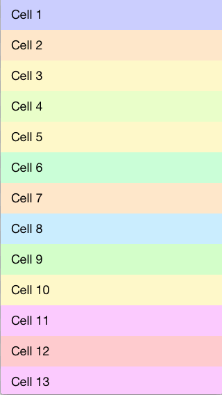

HPReorderTableView
==================

[](http://cocoadocs.org/docsets/HPReorderTableView) [](http://cocoadocs.org/docsets/HPReorderTableView) [](https://travis-ci.org/hpique/HPReorderTableView) 

Drop-in UITableView replacement to reorder cells with long press on any part of the cell.



##Installation

Using [CocoaPods](http://cocoapods.org/):

```ruby
pod 'HPReorderTableView', '~> 0.2'
```

Or add the files from the [HPReorderTableView](https://github.com/hpique/HPReorderTableView/tree/master/HPReorderTableView) directory if you're doing it manually.

##Usage

Simply instance `HPReorderTableView` instead of `UITableView`:

```objective-c
UITableView *tableView = [[HPReorderTableView alloc] init];
```

Or if you're using interface builder, change the class of the table view to `HPReorderTableView`.

Then implement the reordering methods of your table view data source as you would normally do if you were using the default reorder behavior. For example:

```objective-c
- (void)tableView:(UITableView *)tableView moveRowAtIndexPath:(NSIndexPath *)sourceIndexPath toIndexPath:(NSIndexPath *)destinationIndexPath
{
    [_objects exchangeObjectAtIndex:sourceIndexPath.row withObjectAtIndex:destinationIndexPath.row];
}
```

##Customization

See the [documentation](http://cocoadocs.org/docsets/HPReorderTableView) for customization options.

##Requirements

HPReorderTableView requires iOS 6.1 or above and ARC. 

##License

 Copyright 2014 Hermes Pique ([@hpique](https://twitter.com/hpique))
 
 Licensed under the Apache License, Version 2.0 (the "License");
 you may not use this file except in compliance with the License.
 You may obtain a copy of the License at
 
 http://www.apache.org/licenses/LICENSE-2.0
 
 Unless required by applicable law or agreed to in writing, software
 distributed under the License is distributed on an "AS IS" BASIS,
 WITHOUT WARRANTIES OR CONDITIONS OF ANY KIND, either express or implied.
 See the License for the specific language governing permissions and
 limitations under the License.
 
 Uses code from [BVReorderTableView](https://github.com/bvogelzang/BVReorderTableView) by [bvogelzang](https://github.com/bvogelzang).
